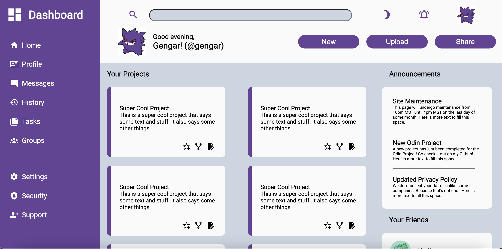
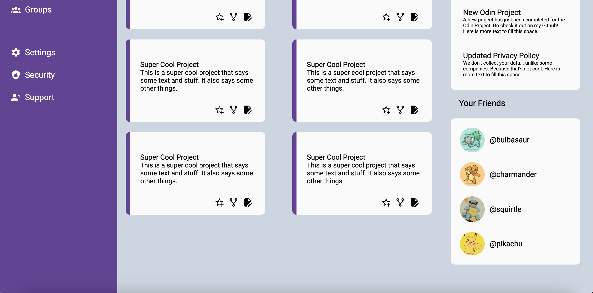
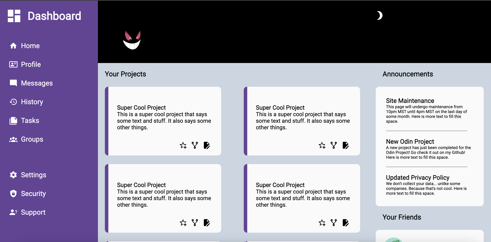
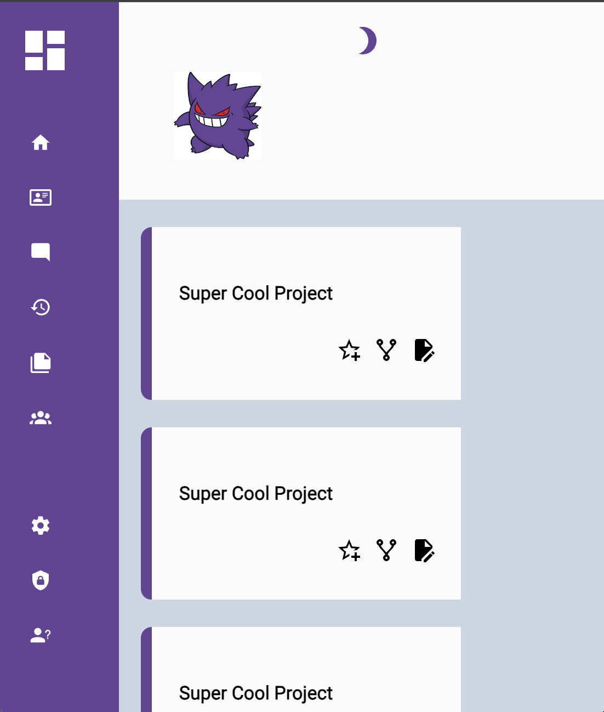

# Admin Dashboard
## Project 7: Admin Dashboard Built Using CSS Grid / Flexbox, HTML, and JavaScript

## Description: 
Welcome to my seventh web development project! This is part of my coursework in The Odin Project, a free, open-source curriculum to learn fullstack web development! 

This project was built in HTML, CSS Grid / Flexbox, and just a little bit of JavaScript! 

The task for this project was to build an admin dashboard. I decided to expand this just for fun! I hope you enjoy! 

## Links:
The full challenge description can be found here: https://www.theodinproject.com/lessons/node-path-intermediate-html-and-css-admin-dashboard#project-solution. 

## Screenshots: 

